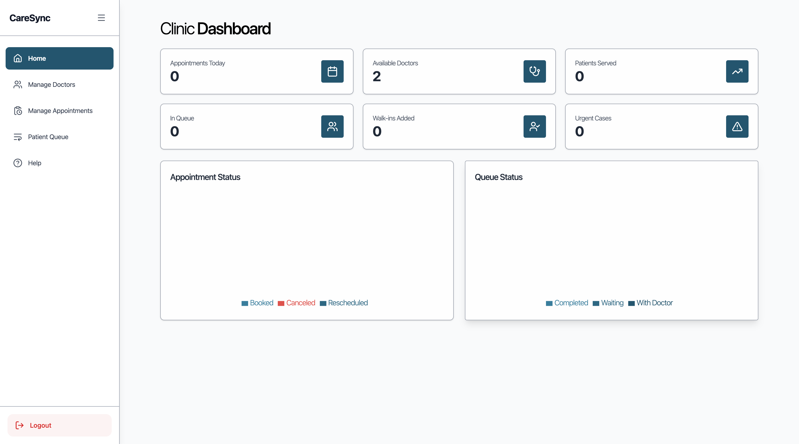
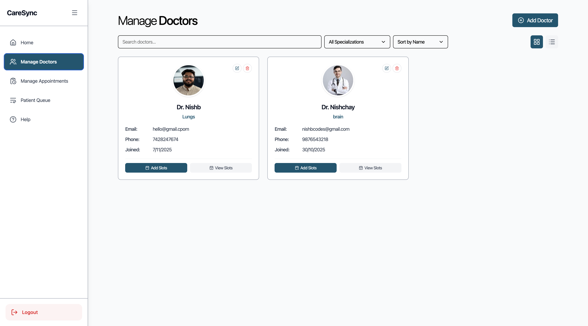
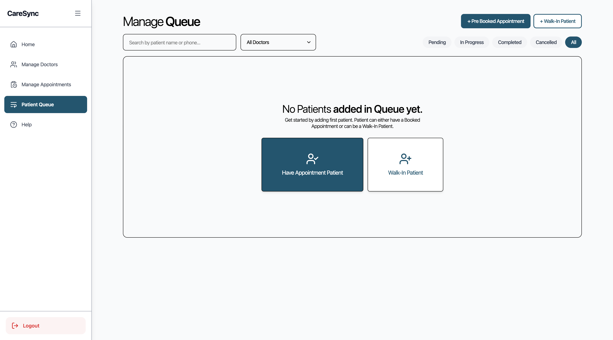
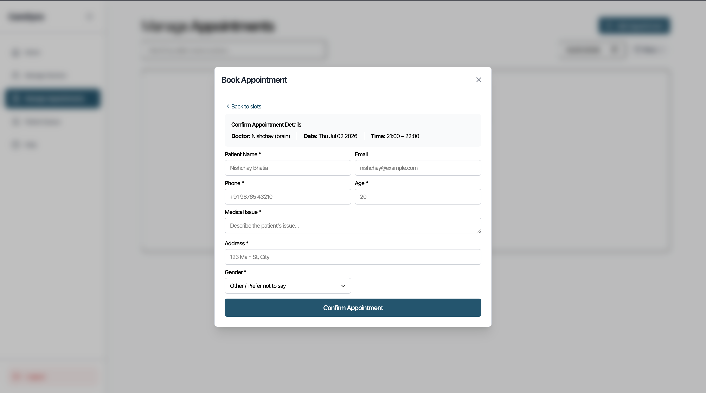

# CareSync — Full-Stack Front-Desk OS for a Clinic

A production healthcare-operations platform that runs a clinic's front desk end to
end: **doctors, appointments, and a live patient queue** in one role-gated system.
The interesting part isn't the CRUD — it's the **queue engine** that merges
pre-booked, walk-in, and emergency patients into a single ordered flow, and the
slot logic that stops two bookings from ever colliding.

> A complete, deployed full-stack build — Next.js frontend on Vercel, an
> Express + Prisma API on Render, Postgres for state, Cloudinary for media, and
> JWT role-based auth throughout. Everything below is mine, front to back.

**Live:** [care-sync-prod.vercel.app](https://care-sync-prod.vercel.app/)  ·  **Demo video:** [YouTube walkthrough](https://www.youtube.com/watch?v=jOoPzpE6Ytg)

## Demo

https://github.com/user-attachments/assets/9842874c-bd74-462e-a6b9-367b49a47cbf

*Full walkthrough — adding doctors and availability slots, booking an appointment through the guided flow, and running the live patient queue end to end.*

## Screenshots

Inside the operator app — dashboard, doctor management, the dual-intake patient queue, and the guided booking flow:

 
 

1. **Dashboard** — live counters (appointments, available doctors, in-queue, walk-ins, urgent) over Recharts status panels.
2. **Manage doctors** — searchable/sortable cards with image, specialization, contact, and per-doctor slot management.
3. **Patient queue** — the dual-intake core: a **pre-booked** patient (by appointment) or a **walk-in**, filtered by Pending / In-Progress / Completed / Cancelled.
4. **Book appointment** — the guided flow: doctor → date → available slot → patient details → confirm, with taken slots never offered.

## What it is

A front-desk operator (the **STAFF** role) signs in and runs the whole clinic
from one dashboard:

- **Doctors** — full CRUD with image upload, specialization, and a JSON
  availability schedule; flip a doctor available/unavailable in one click.
- **Appointments** — pick doctor → date → an *available* slot → patient details →
  confirm. Slots already taken are never offered, so double-booking can't happen.
- **Queue** — a single live queue per doctor that absorbs both **pre-booked**
  check-ins (by appointment code) and **walk-ins** (created on the spot), each
  handed a queue number.
- **Dashboard** — real-time clinic metrics and Recharts visualisations over the
  day's load.

## Architecture

```
   ┌─────────────────────────┐        HTTPS / JWT        ┌──────────────────────────┐
   │   Next.js 15 frontend    │  ───────────────────────▶ │   Express 5 API (Render)  │
   │   (Vercel)               │   Bearer access token     │                          │
   │   landing · auth ·       │ ◀───────────────────────  │   authenticateUser        │
   │   dashboard · doctors ·  │        JSON               │   requiresRole([STAFF])   │
   │   appointments · queue   │                           │        │                  │
   └─────────────────────────┘                           │        ▼                  │
                                                          │   controllers → services │
        ┌──────────────┐   images                         │        │                  │
        │  Cloudinary   │ ◀─── multer ────────────────────┤        ▼                  │
        └──────────────┘                                  │   Prisma ORM              │
        ┌──────────────┐   email                          │        │                  │
        │   Resend      │ ◀───────────────────────────────┤        ▼                  │
        └──────────────┘                                  │   PostgreSQL              │
                                                          └──────────────────────────┘
```

Every protected route runs the same two-stage guard: `authenticateUser` verifies
the JWT access token, then `requiresRole(["STAFF"])` gates the operator surface —
the pattern the whole API is built on.

## The queue engine

The domain model is where the design lives. Five Prisma models
(`User · Doctor · Staff · Patient · Appointment`) and three enums carry the state:

- **`QueueType` = `APPOINTMENT | WALKIN | EMERGENCY`** — one `Appointment` table
  holds all three intake paths, so a doctor's queue is a single ordered list
  regardless of how each patient arrived.
- **`AppointmentStatus` = `PENDING → IN_PROGRESS → COMPLETED | CANCELLED`** — the
  lifecycle each visit moves through on the board.
- **`queueNumber` + `slot` (JSON)** — every appointment carries its position and
  its exact time block; the slot lookup reads a doctor's `schedule` for a date and
  returns only the still-open blocks, so conflicts are prevented at booking time,
  not caught after.

`User` is polymorphic — one auth table with a `role` and an optional link to a
`Doctor`, `Staff`, or `Patient` record — so identity and domain data stay cleanly
separated.

## Tech stack

          

## Run

Needs Node 18+ and a PostgreSQL database.

```bash
# backend  (Express + Prisma API → :8000)
cd Backend
npm install
cp .env.example .env         # DATABASE_URL, JWT_SECRET, CLOUDINARY_*, PORT
npx prisma migrate dev
npm run dev

# frontend (Next.js → :3000)
cd Frontend
npm install
cp .env.example .env.local   # NEXT_PUBLIC_API_URL=http://localhost:8000
npm run dev
```

## API

All routes except `POST /api/auth/login` require a Bearer JWT; STAFF-only routes
additionally pass `requiresRole(["STAFF"])`.

| Group | Routes |
|---|---|
| **Auth** | `POST /api/auth/login` · `POST /api/auth/logout` |
| **Dashboard** | `GET /api/home/` — live clinic metrics |
| **Doctors** | `POST /add` · `PUT /edit/:id` · `GET /all-doctors` · `DELETE /:id` · `DELETE /availability/:id` · `GET /:id/slots` |
| **Appointments** | `POST /schedule` · `POST /reschedule/:id` · `GET /all-appointments` · `DELETE /:id` · `GET /doctor/:id` |
| **Queue** | `GET /api/queue/all` — real-time queue across doctors |

## Layout

| Path | Role |
|---|---|
| `Frontend/src/app/manager/**` | operator surface — home · doctors · appointments · queue |
| `Frontend/src/app/{landingpage,auth,documentation}` | public landing, login, in-app docs |
| `Backend/src/routes/` | auth · doctor · appointment · queue · home route tables |
| `Backend/src/controllers/` · `services/` | request handlers + business logic |
| `Backend/src/middlewares/auth.middleware.ts` | `authenticateUser` + `requiresRole` guards |
| `Backend/prisma/schema.prisma` | 5 models + 3 enums — the domain model |

## Authors

**Nishchay Bhatia** — [LinkedIn](https://www.linkedin.com/in/nishchay-bhatia) · [GitHub](https://github.com/nishb369) · [Email](mailto:nishbcodes@gmail.com)

> A real system, deployed and running: front desk in, ordered patient flow out —
> with the auth, media, and data plumbing a live clinic tool actually needs.
