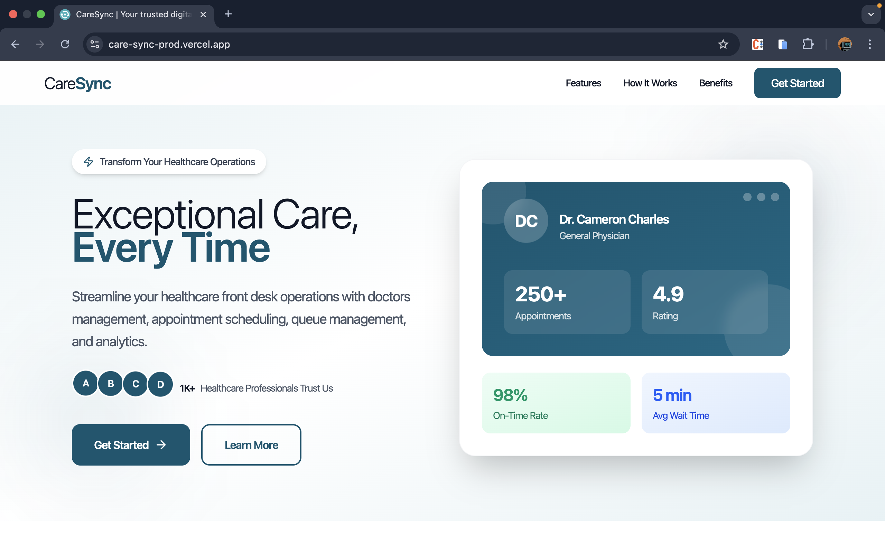

# [CareSync](https://care-sync-prod.vercel.app/)

A comprehensive healthcare management system for efficient patient appointment scheduling, doctor management, and queue organization.

- Live Preview : [CareSync](https://care-sync-prod.vercel.app/)</br>
- Github Repo : [CareSyncProd](https://github.com/NishB369/CareSyncProd)
- Demo Video : [YouTube Video](https://www.youtube.com/watch?v=jOoPzpE6Ytg)

</br>



## Overview

CareSync is a full-stack healthcare management platform designed to streamline clinic operations. It provides an intuitive interface for managing doctors, scheduling appointments, and organizing patient queues - supporting both pre-booked and walk-in patients.

- Frontend - Deployed on Vercel
  </br>
- Backend - Deployed on Render

## Features

### Authentication

- Secure JWT-based authentication
- Email and password login
- Protected routes and role-based access

### Dashboard

- Real-time insights and statistics
- Interactive bar charts for data visualization
- Comprehensive overview of clinic operations

### Doctor Management

- Complete CRUD operations for doctor profiles
- Availability slot management
- View and modify doctor schedules
- Track doctor appointments

### Appointment Management

- Intuitive appointment booking flow:
  - Select doctor
  - Choose date
  - Pick available time slots
  - Fill patient information
  - Booking confirmation
- Reschedule and cancel appointments
- Automated slot conflict prevention

### Queue Management

- **Walk-in Patients**: Direct appointment creation and queue addition
- **Pre-booked Patients**: Quick check-in using appointment code
- Real-time queue status
- Efficient patient flow management

## Tech Stack

### Frontend

- **Framework**: Next.js 15.5.4
- **UI Library**: React 19.1.0
- **Styling**: Tailwind CSS 4
- **Charts**: Recharts 3.2.1
- **Icons**: Lucide React
- **Date Picker**: React DatePicker
- **HTTP Client**: Axios
- **Language**: TypeScript

### Backend

- **Runtime**: Node.js
- **Framework**: Express.js 5.1.0
- **Database ORM**: Prisma 6.16.3
- **Authentication**: JWT (jsonwebtoken)
- **Password Hashing**: bcryptjs
- **File Upload**: Multer
- **Email Service**: Resend
- **Cloud Storage**: Cloudinary
- **Language**: TypeScript

## Project Structure

```
caresync/
├── frontend/
│   ├── src/
│   │   ├── app/
│   │   │   ├── alertpage/
│   │   │   ├── auth/login/manager/
|   |   |   ├── documentation/
|   |   |   ├── landingpage/
│   │   │   └── manager/
│   │   │       ├── appointments/
│   │   │       ├── doctors/
│   │   │       ├── help/
│   │   │       ├── home/
│   │   │       └── queue/
│   │   ├── public/
│   │   └── ...config files
│   └── package.json
│
└── backend/
    ├── src/
    │   ├── controllers/
    │   ├── db/
    │   ├── middlewares/
    │   ├── routes/
    │   ├── services/
    │   ├── types/
    │   ├── utils/
    │   └── index.ts
    ├── prisma/
    └── package.json
```

## Getting Started

### Prerequisites

- Node.js (v18 or higher)
- npm or yarn
- PostgreSQL (or your preferred database)

### Installation

#### 1. Clone the repository

```bash
git clone <repository-url>
cd caresync
```

#### 2. Setup Backend

```bash
cd backend
npm install

# Configure environment variables
cp .env.example .env
# Edit .env with your database and service credentials

# Run database migrations
npx prisma migrate dev

# Build and start server
npm run dev
```

#### 3. Setup Frontend

```bash
cd frontend
npm install

# Configure environment variables
cp .env.example .env.local
# Edit .env.local with your API endpoint

# Start development server
npm run dev
```

#### 4. Access the application

- Frontend: `http://localhost:3000`
- Backend: `http://localhost:8000`

## 🔧 Configuration

### Backend Environment Variables

```env
DATABASE_URL="your-database-url"
JWT_SECRET="your-jwt-secret"
CLOUDINARY_CLOUD_NAME="your-cloudinary-name"
CLOUDINARY_API_KEY="your-cloudinary-key"
CLOUDINARY_API_SECRET="your-cloudinary-secret"
PORT=8000
```

### Frontend Environment Variables

```env
NEXT_PUBLIC_API_URL="http://localhost:8000"
```

## API Endpoints

### Authentication

All endpoints except `/auth/login` require JWT authentication via Bearer token.

- `POST /api/auth/login` - User login with email and password
- `POST /api/auth/logout` - User logout

### Dashboard

- `GET /api/home/` - Get dashboard statistics (requires STAFF role)
  - Returns real-time clinic metrics and insights

### Doctors

- `POST /api/doctors/add` - Add new doctor (requires STAFF role)
  - Supports image upload via multipart/form-data
- `PUT /api/doctors/edit/:id` - Update doctor information (requires STAFF role)
  - Supports image upload via multipart/form-data
- `GET /api/doctors/all-doctors` - Get all doctors (requires STAFF role)
- `DELETE /api/doctors/:id` - Delete doctor (requires STAFF role)
- `DELETE /api/doctors/availability/:id` - Change doctor availability status (requires STAFF role)
- `GET /api/doctors/:id/slots` - Get doctor's available time slots by date (requires STAFF role)

### Appointments

- `POST /api/appointments/schedule` - Schedule new appointment (requires STAFF role)
- `POST /api/appointments/reschedule/:id` - Reschedule existing appointment (requires STAFF role)
- `GET /api/appointments/all-appointments` - Get all appointments (requires STAFF role)
- `DELETE /api/appointments/:id` - Cancel/delete appointment (requires STAFF role)
- `DELETE /api/appointments/doctor/:id` - Get appointments for specific doctor (requires STAFF role)

### Queue

- `GET /api/queue/all` - Get current queue for all doctors (requires STAFF role)
  - Returns real-time patient queue status

## Usage Flow

1. **Landing Page** → Navigate to dashboard
2. **Login** → Authenticate with credentials
3. **Dashboard** → View clinic overview and statistics
4. **Doctor Management** → Add/manage doctors and their schedules
5. **Appointment Booking** → Schedule patient appointments
6. **Queue Management** → Manage patient flow (walk-in + pre-booked)

## License

This project is licensed under the ISC License.

## Authors

- Nishchay Bhatia  
   [LinkedIn](https://www.linkedin.com/in/nishchay-bhatia) | [GitHub](https://github.com/nishb369) | [Email](mailto:nishbcodes@gmail.com)

---

**Note**: This project is under active development. Features and documentation may be updated regularly.
